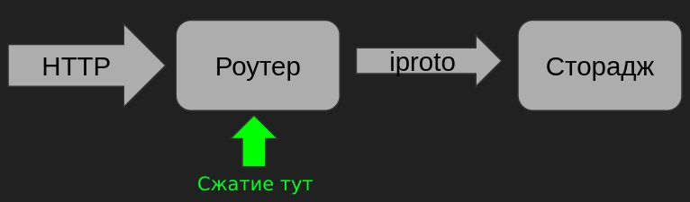
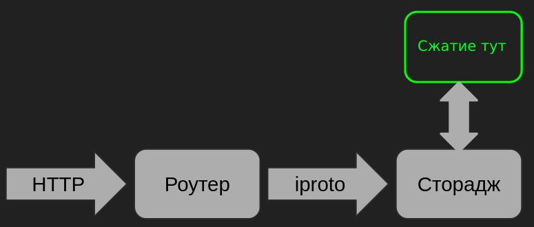

# Подробнее о сжатии данных в Tarantool 2.10
Всем привет! Хотелось бы подробнее рассказать про новую фичу, реализованную в Enterprise-версии
Тарантула, начиная с 2.10 RC-1 - сжатие данных (в оперативной памяти). Мы рассмотрим
что она может и чего не может, как применять и особенности данного функционала.

> Читать дальше

## Как включить
Функционал достаточно прост в использовании - нужно только указать в настройках
поля, что его надо сжимать: `compression = '<вариант>'`.

Доступно два варианта сжатия:
* zstd
* lz4

Например:
```lua
local space = box.schema.space.create(space_name, { if_not_exists = true })
space:format({
    {name = 'uid', type = 'string'},
    {name = 'body', type = 'string', compression = 'zstd'},
})
```

Если это не новый проект, а существующий проект с данными, то нужно ещё вызвать фоновую
миграцию:
```lua
box.schema.func.create('noop', {is_deterministic = true, body = 'function(t) return t end'})
space:upgrade{func = 'noop', format = {
    {name = 'uid', type = 'string'},
    {name = 'body', type = 'string', compression = 'zstd'},
}}
```

Подробнее [здесь](https://www.tarantool.io/en/enterprise_doc/tuple_compression/)

## Реальные результаты
Давайте посмотрим, что получается на примере реальных данных одного телеком оператора.
Данные представляют собой 100 тыс. различных JSON-документов общим объёмом в 316 МБ.


Теперь по очереди применим каждый вариант сжатия. CPU = 3,6 ГГц. Для лучшего сравнения
методов, добавим ещё сжатие с помощью внешней библиотеки ZLIB.

Исходник теста можно посмотреть [тут](https://github.com/a1div0/habr-post-tnt-compress/blob/master/one_instance.lua).

| Метод | Время упаковки и записи в таблицу, сек | Время чтения и распаковки, сек | Конечный размер спейса, МБ | Коэффициент сжатия | Сжатие, % |
| ----- | ------ | ---- | ---- | ---- | ---- |
| ZSTD | 61.222 | 0.889 | 113.234 | 2.790 | 64.16 |
| LZ4 | 7.701 | 0.963 | 186.499 | 1.694 | 40.97 |
| ZLIB* | 16.119 | 3.528 | 121.958 | 2.590 | 61.40 |

`*` Внешняя библиотека ZLIB

(тут добавить гистограмму "время сжатия и записи")
(тут добавить гистограмму "время чтения и распаковки")
(тут добавить гистограмму "размер несжатый и сжатый")
(тут добавить гистограмму "сжатие %")

## Сжатие в кластере
В реальных продуктовых проектах экземпляры Тарантула разделены по ролям. Для
нашего примера важно выделить две:
* маршрутизатор (router)
* хранилище (storage)

Сжатие данных в кластере можно организовать разными способами в зависимости от места сжатия и разжатия. И в каждом
способе есть свои плюсы и минусы. Рассмотрим три варианта.

### Вариант первый - быстрый эффект


Сжимаем и разжимаем в хранилище. Этот вариант обеспечивает описываемый в статье
функционал. Это подходит, если вам нужно быстро, при ничтожных изменениях проекта, высвободить кучу
места.

Звучит здорово, какая цена? Дополнительная нагрузка на ЦП хранилища, его замедление. Более того,
каждая реплика будет повторять то же самое сжатие. Как следствие - это снижает производительность
кластера. Хранилище со встроенным упаковщиком дороже масштабировать. То есть вместо дополнительного
только упаковщика, вам надо рядом поставить хранилище с упаковщиком.

Если вы хотите сохранить производительность кластера, пока что потребуется больше усилий.

### Вариант второй - максимальная производительность


Cжимаем и разжимаем на роутере. Это даёт больше производительности, но здесь встроенное сжатие никак
не поможет. Необходимо подключать внешнюю библиотеку и реализовывать дополнительную логику работы
с ней. И в мастер и на реплики будут попадать уже упакованные данные.

Плюсы:
* не нагружаем хранилище
* уменьшаем трафик между роутером и стораджем
* легче масштабируем - ставим нужное количество роутеров с упаковщиком до требуемой производительности

Минусы:
* нужно реализовать логику упаковщика на роутере

Если хочется большего, например поставить меньше экземпляров, без особой потери производительности,
можно рассмотреть вариант 3.

### Вариант третий - ленивое сжатие


Сжимаем на отдельном экземпляре, разжимаем на роутере. То есть пишем в хранилище как есть с признаком
"не упакован". Далее реализуем отдельную роль "упаковщик", которая проходит по мастер-хранилищам и
упаковывает не упакованное. Если данные поступают быстро и надо паковать быстрее - добавляем ещё
экземпляры упаковщика. На реплики будут попадать уже упакованные данные.

Плюсы:
* процесс сжатия масштабируется максимально выгодно
* меньше экземпляров кластера
* не нагружаем хранилище как в первом варианте

Минусы:
* дополнительный трафик в кластере - между хранилищем и упаковщиком
* некоторая дополнительная нагрузка на хранилище - плюс по одной операции чтения и записи
* нужно реализовать отдельную роль - упаковщик
* нужно реализовать логику распаковки на роутере

### Эффект переноса сжатия на роутер
На фоне предложенных вариантов хочется проследить эффект от переноса сжатия
с хранилища на роутер. Давайте соберём маленький кластер - пусть это будет два экземпляра - роутер и
хранилище. И попробуем его нагрузить при разных способах упаковки.

Реализация стенда:
* Реализация роутера - [тут](https://github.com/a1div0/habr-post-tnt-compress/blob/master/router.lua).
* Реализация хранилища - [тут](https://github.com/a1div0/habr-post-tnt-compress/blob/master/storage.lua).
* Для нагрузочного обстрела на запись модуль - [тут](https://github.com/a1div0/habr-post-tnt-compress/blob/master/k6-test-write.js).
И для него вспомогательный модуль для генерации данных - [здесь]().

Максимальная продолжительность испытаний = 30 секунд. За это время мы генерируем 100 тыс. запросов на запись на роутер 
от лица 10 виртуальных пользователей.
Консольный вывод результатов можно посмотреть [здесь](https://github.com/a1div0/habr-post-tnt-compress/blob/master/k6-results.md).
Ниже результаты сведены в одну таблицу.

| Показатель \ Сценарий                 | Без сжатия | ZLIB | ZSTD   | LZ4        |
|---------------------------------------|-----------|---|--------|------------|
| Запросов выполнено, шт                | 100000    | 100000 | 46964  | 100000     |
| Длительность выполнения запросов, сек | 14.1      | 27.8 | 30.0   | 15.7       |
| K6 data_received, MB                  | 23        | 23 | 11     | 23         |
| K6 data_sent, MB                      | 341       | 342 | 160    | 341        | 
| http_req_blocked, µs                  | 2.46      | 1.81 | 2.12   | 2.17       |
| http_req_connecting, ns               | 13        | 7 | 20     | 16         |
| http_req_duration, ms                 | 0.716     | 2.27 | 5.78   | 0.934 |
| http_req_failed, %                    | 0         | 0 | 0      | 0 |
| http_req_receiving, µs                | 31.1      | 25.59 | 25.8   | 28.71 |
| http_req_sending, µs                  | 20.08     | 16.78 | 19.42  | 19.22 | 
| http_req_waiting, ms                  | 0.665 | 2.22 | 5.74   | 0.886 |
| RPS                                   | 7076      | 3595 | 1565   | 6351 |
| iteration_duration, ms                | 1.4     | 2.77 | 6.38 | 1.56 |

## Выводы
Tarantool развивается. Он обрастает новыми фичами. Встроенный в 2.10EE механизм сжатия
полезен, но он не является панацеей. Порядок действий зависит от конкретной ситуации.
Отсюда и рекомендации по применению.

Возможность сжатия методом LZ4 позволяет высвободить 40% места почти без просадки по
RPS (6351 LZ4 против 7076 без сжатия). При этом включается фактически "Одной галочкой".
На мой взгляд - весьма неплохо.

Если требуется жать сильнее, или производительнее, или дешевле - нужны дополнительные усилия (см. выше).
